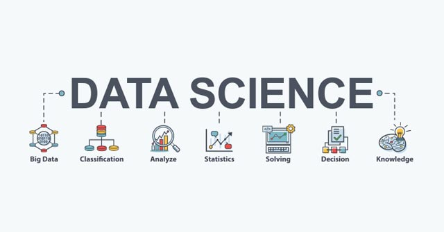
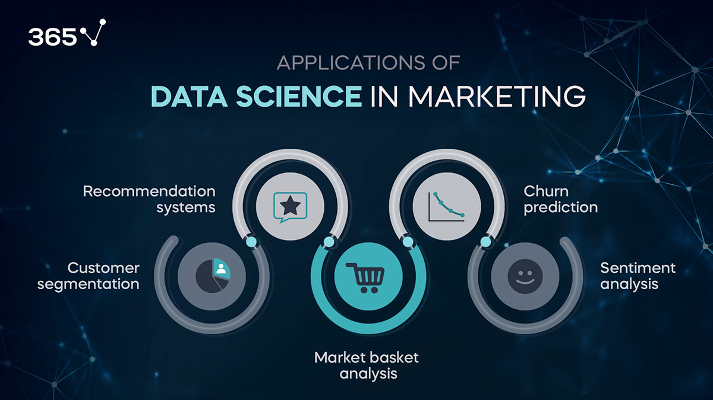
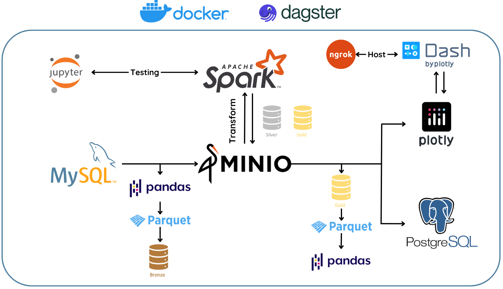

# Data Science là gì? Vì sao mọi người lại cần khoa học dữ liệu?
  
:::info **Data Science:** 
Theo IBM, Data Science (Khoa học dữ liệu) được định nghĩa như sau: "Data science combines math and statistics, specialized programming, advanced analytics, artificial intelligence (AI), and machine learning with specific subject matter expertise to uncover actionable insights hidden in an organization’s data. These insights can be used to guide decision making and strategic planning."
:::

## 1. Như vậy, Data Science là gì?

**Data Science** có thể được hiểu đơn giản là sự kết hợp giữa toán, xác suất thống kê, lập trình, trí tuệ nhân tạo (AI) với kiến ​​thức chuyên sâu về những chủ đề cụ thể (domain knowledge), để khám phá những điều ẩn giấu sâu bên trong dữ liệu. Những phân tích chuyên sâu này có thể được sử dụng để đưa ra quyết định và lập kế hoạch, chiến lược tối ưu nhất.

Vòng đời của data science bao gồm nhiều vai trò của một nghề Data kết hợp với nhau. Các nghề Data có thể kể đến như là:
- Data Scientist
- Data Analyst
- Data Engineer
- Business Intelligence Analyst
- Database Administrator
- Machine Learning Engineer
- Data Security Analyst
- Data Operations Manager
- vô vàn vô vàn... :person_with_pouting_face:

Nhìn chung thì lương của các ngành Data có thể từ mức trung bình đến cao nên theo Role nào trong Data Workflow thì cũng sẽ không lo chết đói (hay thiếu thịt :cow: để ăn).
> "Data doesn't lie" - Dữ liệu không nói dối.

## 2. Big Data là gì mà nghe suốt thế nhỉ?

- Khái niệm Big Data có thể được định nghĩa khá dễ hiểu hơn các khái niệm khác của ngành Data, vì chúng ta chỉ cần nhận biết khi nào nó đủ lớn để gọi là "big data" mà thôi.
- Để một tập dữ liệu được gọi là đủ lớn, thì nó cần đáp ứng đủ tiêu chí lớn với **3V** như sau:
  - **Volume:** khối lượng lớn, kích thước lớn (đương nhiên rồi)
  - **Variety:** độ da dạng không thể kể hết được, từ có cấu trúc đến không cấu trúc, không chỉ là text, số thông thường mà đó có thể là video, hình ảnh,...
  - **Velocity:** tốc độ dữ liệu sinh ra cực khủng (ví dụ như dữ liệu thống kê trên facebook, một giây trôi qua có biết bao nhiêu status đã up và bao nhiêu comment)

## 3. Các lĩnh vực rất cần ngành Data

### Marketing

 

- Phân tích thị trường, phân tích đối thủ cạnh tranh sẽ cho những nhà kinh doanh có những chiến lược hợp lý. 
- Xác định các nhóm người dùng bằng các thuật toán máy học để phân nhóm người dùng và có chiến lược kinh doanh riêng cho từng nhóm, giúp dễ dàng nuôi dưỡng chu trình theo từng nhóm khách hàng.
- Tạo báo cáo cho chiến dịch marketing khoa học hơn, lấy ra được nhiều insight hơn.

### Ngân hàng

  

- Machine Learning và AI cũng có thể được sử dụng để phát hiện các hoạt động gian lận và tự động báo cáo.
- Đảm bảo an ninh cho ngân hàng nhờ quản lý dòng tiền tự động bằng máy học (không có sự can thiệp của con người).
- Việc sử dụng phân cụm trong dữ liệu ngân hàng giúp đưa ra vô số quyết định quan trọng. Ví dụ đơn giản là, xác định các địa điểm chi nhánh nơi tập trung nhiều nhu cầu của khách hàng tiềm năng, để đề xuất lập chi nhánh mới.
- Dự đoán lượng tiền mặt cần thiết sẵn sàng cung ứng ở một chi nhánh tại thời điểm cụ thể hàng năm.
Khoa học dữ liệu hiện đang là nền tảng của hệ thống ngân hàng kĩ thuật số.

### Y tế
:::danger Nhu cầu của Data Science trong Y tế
Sau đại dịch Covid19, nhu cầu của Data Science đang trở nên đặc biệt quan trọng hơn bao giờ hết đối với nhóm ngành Y tế.
:::

  

- Ví dụ đơn giản nhất trong thời Covid đó là cho phép bác sĩ theo dõi tình trạng bệnh nhân bằng để theo dõi hồ sơ sức khỏe điện tử, quản lý ca dự đoán để điều động đội ngũ các bác sĩ cần thiết vào những thời điểm cụ thể.
- Big Data có thể đánh giá các triệu chứng và xác định nhiều bệnh ở giai đoạn đầu.
- Các ứng dụng Big Data cũng có thể báo trước khu vực có nguy cơ bùng phát dịch như: sốt xuất huyết hoặc sốt rét.

## 5. Example for Data Workflow
:::tip
Một ví dụ của một data workflow như sau thông qua DFD (Data Flow Diagram):
:::

Nhìn chung trong một data workflow, data role nào cũng sẽ có một vai trò nhất định ở một giai đoạn xác định.
Chẳng hạn như trong workflow mẫu bên trên là một workflow chính của **Data Engineer/Machine Learning Engineer**, ta có thể thấy:
- **Data Engineeer** sẽ có vai trò ở việc setup các hệ thống này lên như thế nào, hoạt động như thế nào thông qua việc "Dockerize" tất cả các service lại với nhau.
- Sau đó **Data Scientist** cũng sẽ có vai trò ở giữa giai đoạn của DE, đó là làm việc thông qua địa chỉ Jupyter Lab đã được host bởi DE, để phục vụ cho quá trình EDA cũng như test các thuật toán máy học sau khi đã lấy data từ Datalake. 
- Đồng thời, các bạn **Data Analyst** cũng sẽ dễ dàng phát triển báo cáo trực quan của mình thông qua Dash và Plotly đã được setup sẵn bởi các bạn DE trong team. 
- Cuối cùng, ta đó người quản lý database là **Database Adminstrator** (DBA) sẽ quản lý thông qua PostgreSQL.
:::info
**Machine Learning Engineer** sẽ làm việc trong một MLOps (Machine Learning Operation), là một data workflow có áp dụng các thuật toán ML (có thể là thông qua cloud computing), nhằm mục đích train và retrain model tự động thông qua mô hình CI/CD, khiến việc đánh giá model được tự động hóa và dễ dàng rút trích insight từ kết quả của một mô hình hơn.
:::