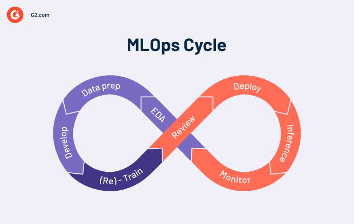
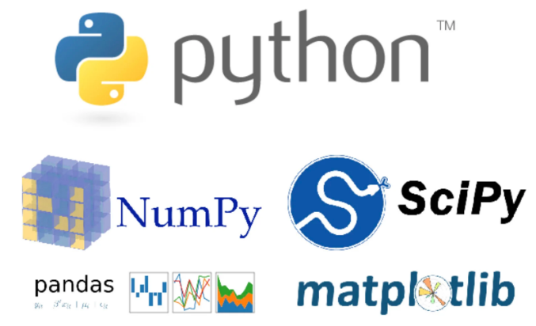
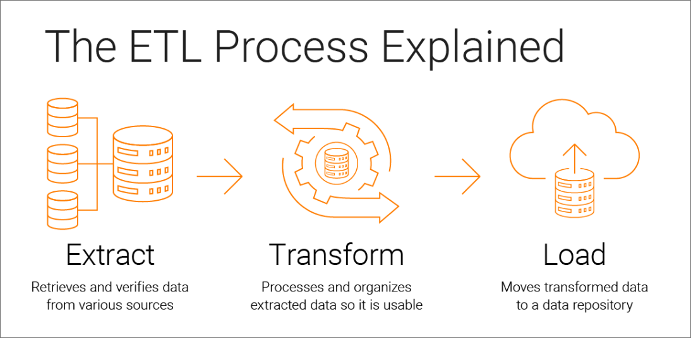
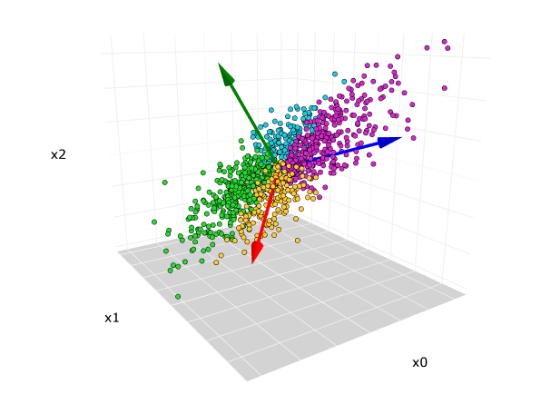

# MLE Journey Map
  
:::info **Very first step:** 
Học ngoại ngữ (Tiếng Anh) ở mức khá để có thể đọc hiểu nhiều tài liệu tiếng anh, vì đa số tài liệu chuyên ngành của Data Science nói chung và Data Engineer nói riêng đều viết bằng tiếng anh.
:::
## 1. Foundations: (kiến thức nền tảng)

- Trước hết, ta sẽ bắt đầu với kiến thức nền tảng vững chắc trong Data Engineer bằng cách hiểu concept của nó là gì, Data structures cũng như nền tảng toán học cho Machine Learning.
- Học một ngôn ngữ lập trình mạnh (hoặc nhiều ngôn ngữ, **recommend** nhất là **Python**), các kiến thức cần học của ngôn ngữu bao gồm control flow, data types, hàm, và lập trình OOP.

## 2. Data Manipulation và Analysis:
  
- Đào sâu vào một số thư viện Python phục vụ cho data manipulation, như Numpy và Pandas.
- Học cách xử lý dữ liệu, làm sạch dữ liệu và cách hiệu quả để **"exploratory data analysis"** (EDA), các bạn có thể học dễ hơn bằng cách áp dụng với các thư viện trong Python.
- Học một ngôn ngữ truy vấn phục vụ cho data manipulation như **SQL**.

## 3. Machine Learning Fundamentals:

- Học những concepts thiết yếu và cơ bản nhất cho máy học như học có giám sát, học không giám sát, feature engineering, model evaluation, và validation techniques.
- Học cách implement những thuật toán cơ bản nhất Machine Learning sử dụng những thư viện như Scikit-learn.

## 4. Làm quen với Big Data

- Học những khái niệm cơ bản về Big Data và những khái niệm, thuật ngữ xoay quanh nó.
- Để bắt đầu với bài tập thực hành đầu tiên deadling với Big Data, mình gợi ý cho các bạn nên bắt đầu với những framework rất nền tảng, rất "basic" như Apache Hadoop và hệ sinh thái của nó, bao gồm HDFS, MapReduce, vaf YARN.
- Hiểu được kiến thức cơ bản về Apache Spark, và cách sử dụng như thế nào cho việc xử lý với **"dữ liệu phân tán" (distributed data)**.
- Khám phá Spark's DataFrame API và RDDs (Resilient Distributed Datasets).

## 5. Data Storage và Data Management:

- Về data storage thì phải nói là ta có khá nhiều options nhưng lời khuyên cho các bạn DE là nên học nhiều nhất có thể trong khả năng của mình (vì ai mà biết liệu công ty sau này mình làm dùng gì đâu đúng không nào), với dữ liệu có cấu trúc thì là PostgreSQL, MySQL,... hay dữ liệu không cấu trúc với MongoDB, Cassandra,...
- Tìm hiểu cơ bản những framework "nặng ký" Apache Kafka để streaming data real-time và process data theo event.
- Học cách Dockerize (hiểu đơn giản là "đóng gói") một project DE lại bằng **Docker** để có thể dễ dàng quản lý các công cụ theo dạng services.

## 6. Xây dựng Data Pipelines: ("đường ống dữ liệu")
  
- Khám phá qua Apache Airflow hay Dagster để có thể setup và điều phối data pipelines.
- Học cách để schedule, monitor, và quản lý các tasks data processing in a distributed environment. (với Docker và Airflow/Dagster).

## 7. Web Development và Deployment:

- Chà, cái này thì có nhiều lựa chọn lắm đây, khi build webapp, các bạn cũng có thể chọn những công cụ khá dễ để nối vào Data Pipelines và trực quan hóa dữ liệu dễ dàng như **Streamlit**, hoặc cũng có thể học những công cụ khá "hardcore" như **Django**, cái khó ở Django không phải là việc setup, mà là việc làm frontend cho webapp, hiểu đơn giản là nó chỉ giúp mình "low-code" phần backend mà thôi, còn việc thiết kế giao diện (ví dụ như bằng React chẳng hạn) thì phải làm bằng "sức cơm".
:::danger
Mình sẽ có một series riêng gồm nhiều bài viết từ cơ bản đến nâng cao về quá trình học Django, làm Backend lẫn Frontend chi tiết nhất có thể.
:::

- Học cách host data-webapp bằng những platform như Vercel hay Heroku.

## 8. Data Modeling trong Warehousing:

- Hiểu được các khái niệm của data modeling và data design.
- Khám phá DBT (Data Build Tool) được sử dụng để "low-code" data transformation và modeling.
- Học những kiến thức nâng cao hơn trong ML data warehousing , như star schemas và dimensional modeling.

## 9. Advanced Machine Learning Topics:
  
- Tìm hiểu những thuật toán machine learning và cách đưa chúng vào trong một Dataflow, bắt đầu từ những cái đơn giản nhất như PCA (Principal Component Analysis), K-means clustering, hay những thuật toán giảm chiều khác.
- Đào sâu vào xử lí ngôn ngữ tự nhiên (NLP), deep learning, và những khía cạnh khác của machine learning, học song song với cách đưa chúng vào trong một Dataflow như thế nào.