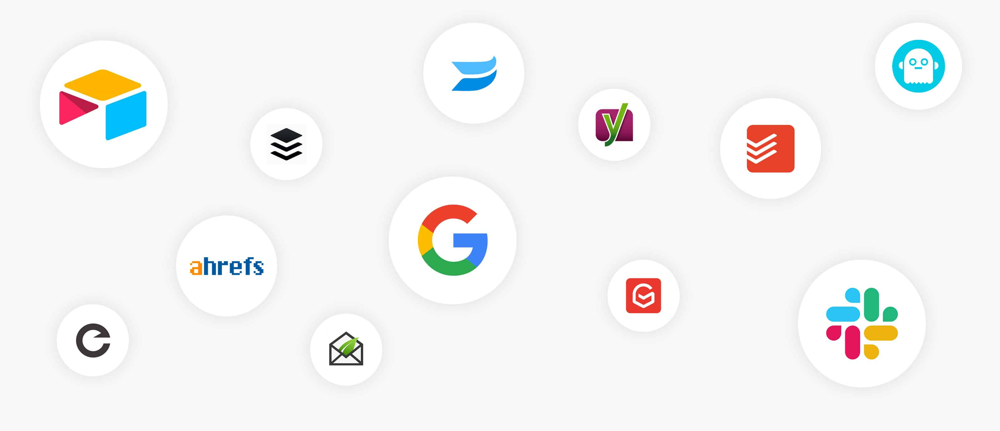
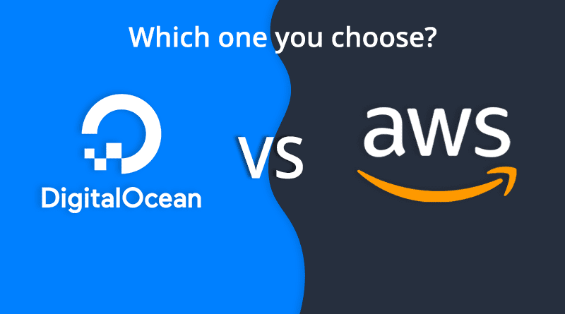
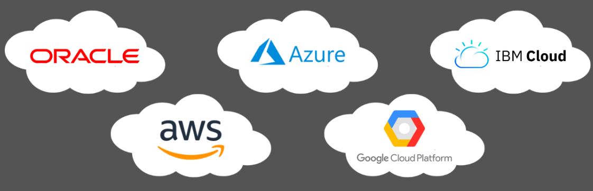
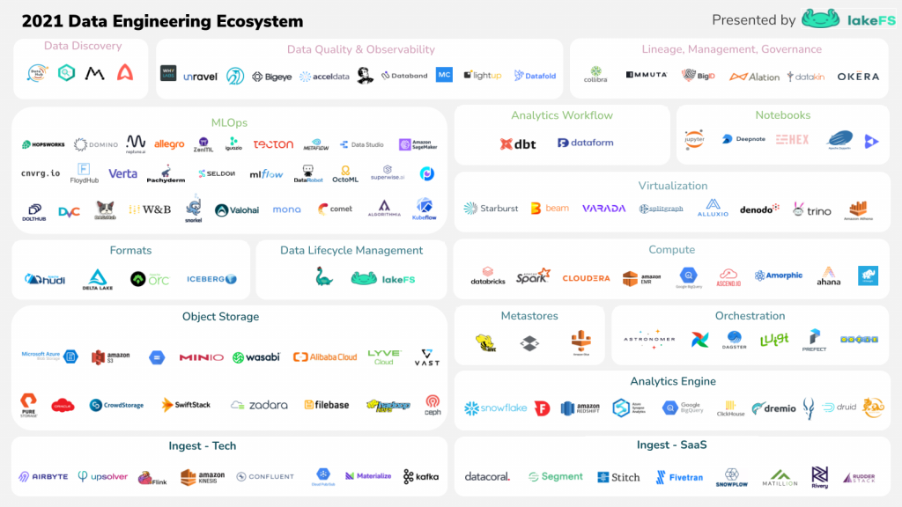

# Cloud Computing AAS

> Khi mới bước chân vào con đường **Data Engineer/DevOps**, hẳn là ai trong số chúng ta cũng đã từng nghe những khái niệm như cloud-aaS, SaaS, etc. Vậy nó là gì vậy nhỉ? Hãy cùng mình giải đáp các khái niệm tuy gần quen mà mơ hồ này nhé.

## :one: Cloud Computing AAS là gì vậy nhỉ?

AAS, hay viết đầy đủ ra là As A Service, thường các nhà cung cấp dịch vụ Cloud (Cloud Provider) sẽ đưa ra các khái niệm này trong mô tả về service của họ, một số Cloud Provider mà ta có thể kể đến như Google Cloud Platform (GCP), Microsoft Azure, Amazon Web Services, Oracle,... thôi nhiêu đây cũng đủ điểm mặt các ông lớn trong làng Cloud rồi đấy nhỉ. :mask:

Vậy thì, "As A Service" cũng có thể hiểu là "Như là một dịch vụ", à ừ đấy, nếu mình nói `Ăn thịt bò As A Service` thì tức là mình ăn :cow: như một dịch vụ mình được cung cấp.

## :two: Khái niệm các loại AAS chính
Nói thật ra thì có nhiều loại Cloud Provider AAS lắm nhưng để mà nói thì mình thường thấy nhiều nhất là ba dạng chính dưới đây thôi:

- **SaaS** hay Software as a Service
- **IaaS** hay Infrastructure as a Service
- **PaaS** hay Platform as a Service

### SaaS (Software as a Service)

 

Hiểu nôm na là phần mềm sẽ cung cấp cho các bạn từ A-Z, đến cả người low-tech cũng có thể dùng được những dịch vụ này.

Đây là các phần mềm được cung cấp dưới dạng dịch vụ mà người sử dụng sẽ trả tiền thuê theo định kỳ (một số cái có thể có gói dùng free) như:
- Gmail, Outlook
- Google Drive, Dropbox
- ...còn rất nhiều nữa nhưng chắc cũng dễ để hình dung nó là gì rồi.

> Ví dụ như mình cần viết những bài take note lại nhưng mình muốn có thể truy cập bài note của mình từ mọi nơi, mình không muốn tự làm backend cho một trang web, nối API, chuyển markdown thành web, nên mình chọn sử dụng **Notion**, đấy gọi là Software as a Service.

### IaaS (Infrastructure as a Service)

  

Cứ hiểu là bạn muốn kinh doanh làm ăn cái gì đó nhưng bạn đang thiếu mặt bằng, và có một nơi (gọi là nhà cung cấp dịch vụ) sẽ mở dịch vụ cho thuê mặt bằng, bạn đến và thuê một mảnh đất nằm giữa đường hoa Nguyễn Huệ kinh doanh bán thịt bò, đấy là "Infrastructure AAS", hay còn gọi là "Cung cấp dịch vụ cơ sở hạ tầng".

Trong chuyên ngành của DevOps, khi ta thuê cơ sở hạ tầng, hiểu đơn giản là ta đang thuê máy tính vật lý của họ gồm server, disks, network, CPU, RAM,...(nhưng mình dùng thông qua Cloud của họ) và sau đó chúng ta có thể làm bất cứ điều gì trên đó, từ hosting cho đến developing. Dùng bao nhiêu trả bấy nhiêu.

### PaaS (Platform as a Service): 

  

Một platform có đầy đủ các tiện nghi phục vụ cho IT solutions, từ OS (Windows hay Linux - thường là Debian), Docker, NodeJS, C#, Java, chỉ cần lên platform phát triển ứng dụng hay muốn host một cái gì đó lên, platform sẽ có công cụ với chức năng tương tự với các tools "from scratch" bên ngoài.
> Platform đang "nóng hổi" dạo gần đây là GCP (Google Cloud Platform)

### OP (On-Premise) - Quan trọng

  

Đa số công ty thì thuê Data Engineer cũng như DevOps làm việc kiểu này, On-Premise tức là build và setup mọi thứ từ đầu (làm from-scratch), thậm chí là sử dụng full các công cụ miễn phí.

Vì thường Budget dành cho Data Engineer không nhiều, budget ở đây là ngân khố phát sinh riêng cho một Project ấy nhé, vì họ đã trả lương cao cho các Data Engineer cũng là để tránh một số tiền khổng lồ từ các services, thật ra dù trả cho DE lương cao thì tiền vẫn đỡ hơn build một Data Pipelines chạy từ đầu đến cuối kể cả Storage lẫn Management, chắc mỗi tháng gửi bill về chục nghìn đô là ít :cry:.
## :three: Ví dụ dễ hiểu cho ba loại service

| KHÁI NIỆM | ĂN :cow: NƯỚNG                                                                                                                                                   | SOFTWARE                                                                                                                                                                          |
| --------- | ---------------------------------------------------------------------------------------------------------------------------------------------------------------- | --------------------------------------------------------------------------------------------------------------------------------------------------------------------------------- |
| OP        | Tự chăn bò và mần bò, chuẩn bị các thành phần như gia vị, đồ nghề để nướng. Tự canh lửa, nướng thịt bò cho chín.                                                 | Tự mua phần cứng, lắp mạng, mua IP tĩnh, gắn domain, cài hệ điều hành, runtime (Java, PHP, MySQL), triển khai ứng dụng để người khác sử dụng.                                     |
| IaaS      | Mua thịt bò tươi từ chợ, có sẵn các thành phần cần thiết. Chỉ việc nướng thịt bò để có món bò ngon miệng.                                                        | Azure tạo một máy chủ ảo (VPS) cho bạn, có sẵn Windows/Linux, mạng và IP. Bạn chỉ cần truy cập vào máy chủ đó qua SSH/remote desktop, cài đặt PHP/C#/NodeJS, triển khai ứng dụng. |
| PaaS      | Mua một bịch bò khô ăn vặt đặt từ Taobao, thịt bò đã được nêm nếm và chế biến sẵn. Khi cần, bạn chỉ cần lấy và ăn, rồi rửa bát. Bạn không phải lo việc nướng bò. | Azure/AWS hosting cung cấp môi trường có sẵn PHP/C#/NodeJS. Bạn chỉ cần tải lên mã nguồn lên đó, sản phẩm sẽ chạy.                                                                |
| SaaS      | Bạn đến một nhà hàng sang trọng (như Home Mì ăn bò ngon lắm nha), được phục vụ thịt bò đã nướng sẵn. Bạn chỉ việc ăn và trả tiền, không phải tự nướng bò.        | Bạn sử dụng ứng dụng của một bên cung cấp, không cần cài đặt server gì. Khi gặp vấn đề, liên hệ bên cung cấp để sửa chữa!                                                         |

## :four: Các Cloud Providers đáng tin cậy
1. **SaaS:** Microsoft Office 365, Google Workspace, Dropbox, Slack, Zoom, Adobe Creative Cloud, Cisco Webex, HubSpot, ServiceNow.

2. **IaaS:** Amazon EC2, Google Cloud Instance.

3. **PaaS:** Microsoft Azure, Google Cloud Platform (GCP), Heroku, IBM Cloud, Oracle Cloud Platform, Salesforce App Cloud.

:::info References:
Tham khảo bài viết và video của anh Tôi Đi Code Dạo.
:::

